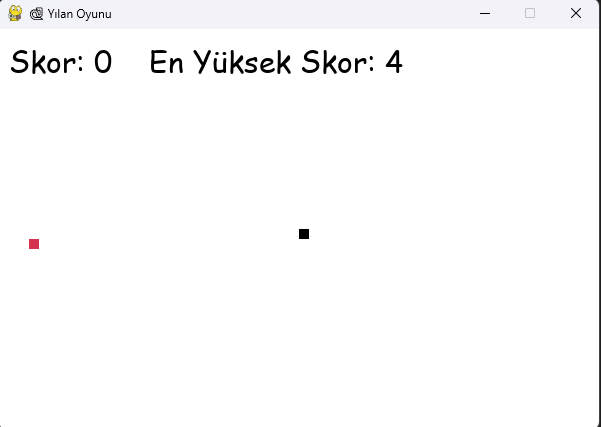
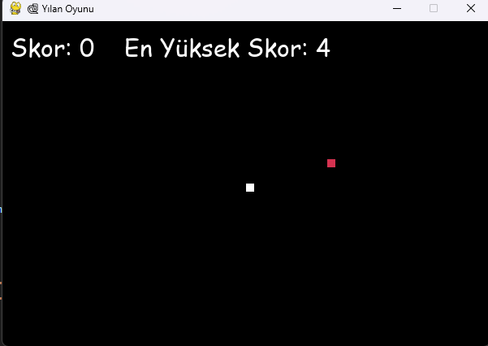

# Snake-GamewithPython-pygame-# Yılan Oyunu (Snake Game) - Python Pygame ve GUI

## Açıklama
Bu proje, **Python** programlama dili ve **Pygame** kütüphanesi kullanılarak yapılmış klasik **Yılan Oyunu**'dur. 
Oyuncular yılanı kontrol eder, yiyecekleri toplar ve yılanın uzunluğunu artırarak en yüksek skoru elde etmeye çalışırlar.
 Oyun, **GUI (grafik kullanıcı arayüzü)** eklenerek görsel olarak daha kullanıcı dostu hale getirilmiştir. 
 Ayrıca, **tema seçimi** ve **zorluk seviyesi** gibi kişiselleştirilebilir özellikler de mevcuttur.

## Özellikler
- **Başlangıç Ekranı (GUI):** Oyun başladığında pembe renkli bir arka planda, kullanıcıya iki buton sunulur:
  - **Tema Değiştir:** Kullanıcı, oyunun temasını açık/koyu yapabilir.
  - **Zorluk Seçimi:** Kullanıcı kolay, orta, zor zorluk seviyelerinden birini seçebilir.
- **Tema:** İki tema seçeneği vardır:
  - **Açık Tema:** Arka plan beyaz, yılan siyah olur.
  - **Koyu Tema:** Arka plan siyah, yılan beyaz olur.
- **Zorluk Seviyesi (GUI Seçimi):**
  - **Kolay Mod:** Yılan yavaş hareket eder.
  - **Orta Mod:** Yılan normal hızda hareket eder.
  - **Zor Mod:** Yılan hızlı hareket eder.
- **Skor ve En Yüksek Skor:** Oyuncunun geçerli skoru ve en yüksek skoru ekranda gösterilir. En yüksek skor, oyunun sonunda kaydedilir.
- **Ekran Bilgileri:** 
  - Skor yazısı, temaya göre siyah veya beyaz renkte görünür.
  - En yüksek skor yazısı temaya göre renk değiştirir.
- **Tuşlar ile Kontrol:** Ok tuşlarıyla yılanı yönlendirebilirsiniz (yukarı, aşağı, sağa, sola).

## 🖼️ Arayüz Görünümü

| Açık Tema | Karanlık Tema |
|----------|----------------|
|  |  |

## Gereksinimler
- Python 3.x
- Pygame Kütüphanesi

### Gerekli kütüphaneyi yüklemek için:

pip install pygame
